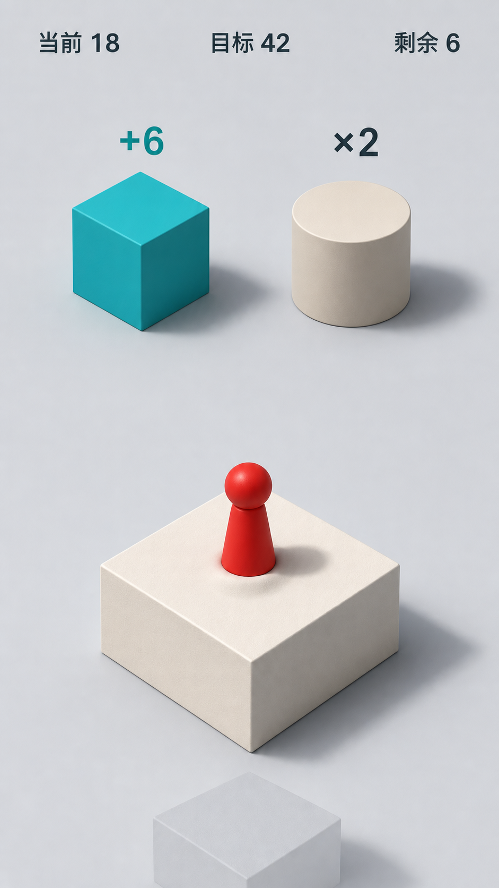

# 数域跃迁（Number Strategy Jump）v3

一款以“左右选择数值运算 + 按住蓄力跳跃”为核心的竖屏小游戏。v3 保留现有数值策略、连续世界、真实落点、碰撞规则、测试和 Web/微信/抖音平台适配层，将原 Canvas 2D 表现层重构为 Three.js/WebGL2 三维场景。

> **项目状态：** Web、微信、抖音默认入口已切换到 Arena V1 Product Session：独立轻量物理、1v1 MatchCore、隐藏本地机器人、三件装备、地图时间轴、语义移动/触控、程序化角色、HUD、角色选择、奖励和重赛已连成产品闭环。Web 使用语义 DOM，微信/抖音共享单 Canvas Product UI；Web `/greybox.html` 与小游戏 `game-greybox.js`/`build:greybox` 保留可执行回退。Stage 7 已在 S7.1 表现合同之外补充来源中立的正式资产 Intake Policy、Definition/内容/许可/证明绑定与文件复验，但没有真实正式资产。Stage 8 S8.1～S8.5.5 已落地；S8.5.6 六目标设备证据合同与三端构建 Manifest 已就绪，但微信/抖音开发者工具及两端 iOS/Android 真机 Record 尚未采集。Stage 9 S9.1～S9.3 已建立实验、Replay V5、fuzz、生命周期回归门与 11 条命 Product 默认；S9.4a 已建立 high/medium/low 质量 Definition、有界性能 Probe、六目标性能 Policy/证据和三端包体预算；S9.5a/b 已建立预注册真人研究、同 Product 采集端口、独立可恢复 Web 工作台、离线原子入库与逐 Tick Replay/Bot 复验；S9.6a 已固定 12 门 RC 交接，S9.6b1-b5b 已让构建、回放、平衡、回归、输入盲测、Stage 6/8 设备、性能、真人研究和缺陷账本共十一门支持语义复算，仅正式资产门仍保持未验证。正式双角色、真实 Intake Bundle、六个真实 target Record、输入 A/B 真人盲测与至少 90 名合格完成者仍未完成。数值跳台 v3 代码与资产继续保留，两条领域代码保持隔离。

v3 的动作与构图参考开源项目 [`shenmaxg/web-jump`](https://github.com/shenmaxg/web-jump)，但不使用它的单路线玩法作为游戏规则，也不直接复用来源不明的品牌纹理。参考代码的 MIT 许可与归属见 [THIRD_PARTY_NOTICES.md](THIRD_PARTY_NOTICES.md)。

> 当前文档描述 v3 的目标架构与验收边界。自动化测试或本机浏览器成功不等于真机通过；微信、抖音 iOS/Android 的 WebGL2、触摸、前后台、安全区和性能仍必须用最终构建产物验收。

## 视觉基线

v3 概念图：[`public/assets/concept/web-jump-three-v3.png`](public/assets/concept/web-jump-three-v3.png)。本机运行验收截图：[`docs/render-final-v3.jpg`](docs/render-final-v3.jpg)。其实现规则见 [v3 视觉与动作系统](docs/design-system-v3.md)。



## 玩法核心

- 玩家从当前平台出发，前方始终有左右两个运算候选。
- 只有按住底部 `↖` / `↗` 按钮才会锁定左/右路线并蓄力，松开后按真实按住时长起跳；点击场景不会误触。
- 只有物理落点位于目标平台顶面内，才执行运算并扣除一步。
- 落地保留真实偏心位置，因此会改变下一跳的实际距离和所需力度。
- 在有限步数内让当前值精确等于目标值。

## 快速开始

需要 Node.js 20 或更高版本。

```bash
npm install
npm run dev
```

执行完整自动化检查：

```bash
npm run check
```

Arena 阶段 1～2 验证：

```bash
npm run arena:poc
npm run arena:poc:stress
npm run arena:poc:build
npm run arena:stress
npm run arena:experiment:matchcore
npm run arena:experiment:map
npm run arena:experiment:movement
npm run arena:experiment:bot
npm run arena:experiment:balance
npm run arena:experiment:balance:explore -- --describe
npm run arena:experiment:balance:validate:describe
npm run arena:experiment:report:verify -- <report.json>
npm run arena:map:stress
npm run arena:movement:stress
npm run arena:input:fuzz
npm run arena:replay:verify
npm run arena:regression
npm run arena:regression:evidence -- --describe
npm run arena:build:budget
npm run arena:performance:evidence -- --describe
npm run arena:human-fairness:evidence -- --describe
npm run arena:stage9:readiness -- --describe
```

`arena:poc:build` 生成 Web、微信、抖音无渲染 MatchCore POC；专业 `arena:experiment:*` 命令通过通用 Runner 运行版本化实验；`arena:stress` 直接驱动同一 MatchCore workload case 测量 CPU/GC，避免把通用编排成本误算为 Core 成本。`arena:experiment:balance` 使用不可由 CLI 改写的 300 个 paired seed，共运行 900 局 S9.3 基线；Collector 阈值进入 Definition V2 hash。`arena:experiment:balance:explore` 固定比较 9/11/13 条命，使用与 baseline/validation 隔离的 60 paired seed，并把三份 Report 和机器 Selection 写入可重建 Bundle。使用 `--output=<new.json>` 可写入禁止覆盖的完整 Report Bundle，随后由对应 verifier 重构并校验。旧的 Map/Movement/Bot stress 命令继续保留宿主计时和兼容摘要，不复制权威驱动或专业断言。Movement 的 Stage 9 门让全部 100 个 seed 使用 4,200 tick 长时限，统一覆盖地图塌陷；`arena:input:fuzz` 随机验证两套 Mapper 的多指、取消、resize、暂停恢复和完整回放，也可通过 `--mapper`、`--match-index`、`--match-seed` 将失败隔离为单一严格回放 case。`arena:replay:verify` 对提交的 Replay V5 语料同时执行严格重放与场景再生成；`arena:regression` 仍是日常 shell 聚合，`arena:regression:evidence -- --output <repo 外.json>` 则按固定 Definition 无 shell 执行 input fuzz、六文件生命周期矩阵、两条 100 局 Session soak 和 200 局 Product stress，只在全部结构化结果通过时原子生成单一 Report。

Arena 阶段 3 机器人验证：

```bash
npm run arena:bot:stress
```

该门禁检查 10,000 个 seed 的隐藏难度分布，并用 300 个 paired seed 分别运行 easy/normal/hard，共 900 局无渲染对局。三档共享相同地图、装备和对手随机条件，难度差异只来自 Bot Profile；它验证相对能力、回放和人类输入边界，不替代真人数据下的最终胜率平衡。

构建产物：

```text
dist/
├── web/       # 普通浏览器静态站点
├── douyin/    # 导入抖音小游戏开发者工具
└── wechat/    # 导入微信开发者工具
```

## 手机局域网预览

手机和电脑连接同一 Wi-Fi 后，让 Vite 监听所有本机网卡：

```bash
npm run dev:lan
```

验收生产构建时使用：

```bash
npm run build
npm run preview:lan
```

再在手机打开终端显示的 `Network` 地址。更换 Wi-Fi 后电脑的局域网 IP 通常会变化，之前的地址不应继续作为验收入口。Web 预览只能验证浏览器路径，不能代替微信或抖音真机验收。

## 微信与抖音导入

1. 执行 `npm run build`。
2. 在对应开发者工具中导入 `dist/wechat` 或 `dist/douyin`。
3. 填写项目方的真实 AppID；不要把仓库中的占位配置当作发布凭据。
4. 在开发者工具先检查 WebGL2 创建、首帧、触摸和前后台。
5. 分别使用 iOS 与 Android 真机完成 [平台验收清单](docs/platform-checklist.md)。

默认 `game.js` 是 Product Session。需要验证或紧急回退到旧灰盒入口时执行 `npm run build:greybox`；构建目录还会同时保留 `game-product.js` 与 `game-greybox.js` 供核对。Web 回退入口为 `/greybox.html`。

每次构建会在三端目录生成 `arena-build-manifest.json`。使用 `npm run arena:build:verify` 重算全部产物；正式设备证据还必须增加 `-- --require-clean-source`。Stage 8 Definition 与证据校验使用 `npm run arena:product:device:evidence -- --describe`，执行手册见 [Stage 8 产品设备验收](docs/acceptance/stage8/README.md)。

Stage 9 无渲染实验入口为 `npm run arena:experiment`。默认 suite 是 30-seed `scripted-pressure` 基础验证；专业 suite 为 `matchcore-invariants`、`map-timeline`、`movement-stress`、`bot-capability` 和固定样本的 `balance-candidate`。先用 `--describe` 审核固定 commit、完整 Match config、Authority hash、seed、workload、collector 参数和停止条件；只有 clean source、全部 case 完成且全部 Collector 阻断门通过时，Report 才会标记 `freezeEligible=true`。这里的可冻结只表示实验资产可复现，不等于真人公平性或发布批准。开发中可显式增加 `--allow-dirty` 检查逻辑，但该结果不能进入冻结评审。

Stage 9 表现性能使用 `npm run arena:build:budget` 重算三端包体门，使用 `npm run arena:performance:evidence -- --describe` 查看六个目标机的质量、帧时间、资源、内存与生命周期合同。完整操作见 [S9.4 性能与长稳验收手册](docs/acceptance/stage9/README.md)。本机/桌面门通过只证明工程基础，不能替代真实 target Record。

Stage 9 真人公平性使用 `npm run arena:human-fairness:evidence -- --describe` 查看固定三隐藏组、样本、胜率、感知与时长门。正式 Bundle 会逐 Tick 重生机器人输入并严格重放；完整协议见 [S9.5 真人公平性验收手册](docs/acceptance/stage9-human-fairness/README.md)。当前合同、工作台与复验通过不等于已有真人证据。

最终 clean Web 构建可通过 `/study.html` 打开独立 S9.5 工作台。单参与者原始包使用 `arena:human-fairness:ingest` 离线入库；入库和最终 `arena:human-fairness:evidence` 都强制提供 `--build-root`，重算完整构建 Manifest 后才接受 commit/build 身份。

Stage 9 RC 交接门使用 `npm run arena:stage9:readiness -- --describe` 查看。S9.6b1-b5b 已启用十一个 producer：构建两门复用同一组三端 Manifest 并重新遍历产物；黄金回放、平衡验证与原子组合回归各自重算；Stage 6/8 设备、性能和真人研究复用原 CLI 的共享 verifier；缺陷门从版本化账本派生开放严重度和残余风险结论；输入盲测重算原始 Audit，并强制绑定 clean Web build 与同候选 Stage 6 E3。外部材料即使合同合法，样本不足仍只能得到 `incomplete`。source producer 还要求当前 clean checkout 与候选 commit 完全一致且复验前后身份稳定。仅正式资产尚未适配，候选 JSON 中未经复算的 `ready` 仍按 incomplete 处理；完整缺口见 [Stage 4～9 证据矩阵](docs/quality/arena-stage4-9-evidence-matrix.md)，输入采集见 [S6.6 Input Pilot 正式证据手册](docs/acceptance/stage6-input-pilot/README.md)，缺陷账本见 [S9.6 缺陷与风险账本手册](docs/acceptance/stage9-release/README.md)。

## v3 架构

```text
src/
├── core/                   # 数值、世界、轨迹与碰撞；唯一玩法真相
├── platform/               # Web / wx.* / tt.* 画布、输入、生命周期和设备能力
├── runtime/                # 固定步长编排与核心→表现快照同步
├── render3d/
│   ├── renderer3d.js        # Renderer3D 外观，隔离 Three.js 内部细节
│   ├── stage.js             # WebGLRenderer、世界 Scene 与 HUD Scene
│   ├── camera-rig.js        # 正交相机与连续构图
│   ├── lighting-rig.js      # 环境光、方向光与受限阴影
│   ├── character-rig.js     # 蓄力形变、回弹、空翻与失败表现
│   ├── platform-*.js        # 平台 Mesh 工厂与 ID→View 注册表
│   ├── effects/             # 拖尾与粒子，只反映事件而不判定结果
│   └── hud/                 # 同一 WebGL Canvas 上的独立 HUD Scene
└── entry/                   # Web / 微信 / 抖音入口
```

数据严格单向流动：

```text
平台输入 → Runtime → Core 状态/碰撞结果 → 只读快照 → Renderer3D
```

Three.js Mesh、缓动和特效不得反向修改核心世界，不得决定是否落地，也不得把偏心落点吸附到平台中心。详细理由见 [技术架构](docs/architecture.md) 和 [ADR](docs/decisions/)。

## 重要边界

- 核心层不直接访问 Three.js、DOM、`window`、`tt.*` 或 `wx.*`。
- 物理和状态更新使用固定逻辑步长；渲染只消费快照。
- 世界 Scene 与 HUD Scene 共用一个上屏 WebGL Canvas。
- `worldRoot` 的视觉平移不改变核心平台的绝对世界坐标。
- 角色形变、空翻、拖尾、倾倒和粒子只属于表现层。
- 现代 Three.js 路径以 WebGL2 为前提；任一目标真机不满足时，必须重新评审版本或降级路径，不得忽略失败。

## 文档

- [产品状态索引](PRODUCT.md)
- [Arena V1 产品愿景](docs/product/arena-v1-vision.md)
- [Arena V1 游戏规则](docs/gameplay/arena-v1-rules.md)
- [Arena V1 分阶段路线](docs/roadmap/arena-v1-vertical-slice.md)
- [Arena Stage 5～9 决策门](docs/roadmap/stage5-9-decision-gates.md)
- [Arena V1 架构提案](docs/architecture/arena-v1-proposal.md)
- [Arena Stage4 Rule/Core 执行管线](docs/architecture/arena-stage4-rule-pipeline.md)
- [Arena Stage5 地图权威执行管线](docs/architecture/arena-stage5-map-pipeline.md)
- [Arena Stage6 输入、移动与灰盒执行计划](docs/architecture/arena-stage6-input-movement-plan.md)
- [Arena Stage6 验收与证据矩阵](docs/quality/arena-stage6-verification-matrix.md)
- [Arena Stage7 角色、动画与反馈执行计划](docs/architecture/arena-stage7-presentation-plan.md)
- [Arena Stage8 局外产品循环与本地进度执行计划](docs/architecture/arena-stage8-product-progression-plan.md)
- [Arena Stage9 平衡、可靠性与性能收敛计划](docs/architecture/arena-stage9-convergence-plan.md)
- [Arena Stage9 S9.4 性能与长稳验收手册](docs/acceptance/stage9/README.md)
- [Arena Stage9 S9.5 真人公平性验收手册](docs/acceptance/stage9-human-fairness/README.md)
- [Arena Stage6 S6.6 Input Pilot 正式证据手册](docs/acceptance/stage6-input-pilot/README.md)
- [Arena Stage9 S9.6 缺陷与风险账本手册](docs/acceptance/stage9-release/README.md)
- [Arena V1 角色索引](docs/characters/README.md)
- [GitHub 方案调研](docs/research/github-arena-references.md)
- [Arena 物理 POC 结果](docs/research/arena-physics-poc-results.md)
- [Arena MatchCore 压测结果](docs/research/arena-matchcore-stress-results.md)
- [Arena Stage5 地图压测结果](docs/research/arena-map-stress-results.md)
- [Arena Stage6 S6.1 合同门禁结果](docs/research/arena-stage6-contract-results.md)
- [Arena Stage6 S6.2 Movement 门禁结果](docs/research/arena-stage6-movement-results.md)
- [Arena Stage6 S6.3 Bot 移动与公平性门禁结果](docs/research/arena-stage6-bot-movement-results.md)
- [Arena Stage7 S7.1 表现合同与占位实例门禁结果](docs/research/arena-stage7-presentation-contract-results.md)
- [Arena Stage7 正式资产入库手册](docs/acceptance/stage7-formal-assets/README.md)
- [Arena Stage7 正式资产 Intake 合同门禁结果](docs/research/arena-stage7-formal-asset-intake-results.md)
- [Arena Stage8 S8.3 奖励与解锁结果](docs/research/arena-stage8-reward-progression-results.md)
- [Arena Stage8 S8.4 对称内容池与快捷重赛结果](docs/research/arena-stage8-content-pool-results.md)
- [Arena Stage8 S8.5.1～S8.5.3 产品表现基础](docs/research/arena-stage8-product-presentation-foundation.md)
- [Arena Stage8 S8.5.4 Product Renderer 与 Web 宿主结果](docs/research/arena-stage8-product-renderer-web-results.md)
- [Arena Stage8 S8.5.5 Canvas Product UI 与三端默认入口结果](docs/research/arena-stage8-canvas-product-entry-results.md)
- [Arena Stage8 S8.5.6 产品设备证据合同](docs/research/arena-stage8-device-evidence-contract.md)
- [Arena Stage9 S9.1 可复现实验基础](docs/research/arena-stage9-s9.1-experiment-foundation.md)
- [Arena 机器人压测结果](docs/research/arena-bot-stress-results.md)
- [技术架构](docs/architecture.md)
- [v3 视觉与动作系统](docs/design-system-v3.md)
- [平台与真机验收清单](docs/platform-checklist.md)
- [游戏规则与玩法](docs/gameplay-rules.md)
- [产品边界](PRODUCT.md)
- [ADR-001：Three.js/WebGL2 单 Canvas](docs/decisions/001-threejs-webgl2-single-canvas.md)
- [ADR-002：核心状态单向驱动表现层](docs/decisions/002-core-driven-presentation.md)
- [ADR-003：`web-jump` 参考与 MIT 合规](docs/decisions/003-web-jump-reference-and-license.md)
- [ADR-004：Arena V1 首版采用隐藏本地对手的 1v1](docs/decisions/004-arena-v1-local-bot-first.md)
- [ADR-005：Arena V1 采用轻量街机物理](docs/decisions/005-arena-lightweight-physics.md)
- [ADR-006：Arena V1 使用项目内 tick 驱动的效用机器人](docs/decisions/006-arena-local-tick-utility-bot.md)
- [ADR-007：Arena 采用项目内数据驱动 Rule/Core 分层](docs/decisions/007-arena-rule-core-governance.md)
- [ADR-008：Arena 地图使用独立权威时间轴](docs/decisions/008-arena-map-authority-timeline.md)
- [ADR-009：Arena 使用语义输入与独立 Movement 权威（提议）](docs/decisions/009-arena-semantic-input-and-movement-authority.md)
- [ADR-010：Arena 使用语义表现合同与独立资产注册表（S7.1 已接受）](docs/decisions/010-arena-semantic-presentation-and-assets.md)
- [ADR-027：正式资产先经过来源、授权与字节级入库合同](docs/decisions/027-arena-formal-asset-intake-provenance.md)
- [ADR-028：跨 Gate 只共享证据标量合同，不共享领域状态机](docs/decisions/028-arena-shared-evidence-value-contract.md)
- [ADR-011：Arena 使用版本化双槽本地进度与对称内容池](docs/decisions/011-arena-versioned-local-progression.md)
- [ADR-012：Arena 使用可复现实验收敛并只降级表现层](docs/decisions/012-arena-reproducible-convergence.md)
- [ADR-013：Arena 盲测使用本地证据工作区](docs/decisions/013-arena-pilot-local-evidence-workspace.md)
- [ADR-014：Arena 使用版本化真机验收证据](docs/decisions/014-arena-versioned-device-acceptance-evidence.md)
- [ADR-015：Arena 使用无 UI 显式产品状态机与单 Match 所有权](docs/decisions/015-arena-headless-product-session-lifecycle.md)
- [ADR-016：Arena 使用单未结算结果与本地幂等奖励事务](docs/decisions/016-arena-local-match-reward-transaction.md)
- [ADR-017：Arena 每局冻结双方对称的权威内容选择](docs/decisions/017-arena-frozen-symmetric-match-content.md)
- [ADR-018：Arena 产品表现使用版本化 ViewModel、意图端口与非拥有 Match 桥](docs/decisions/018-arena-product-presentation-contracts.md)
- [ADR-019：Arena 产品渲染使用组合 Renderer，Web 菜单使用语义 DOM 宿主](docs/decisions/019-arena-product-renderer-and-web-host.md)
- [ADR-020：小游戏产品 UI 使用单 WebGL Canvas 叠层，三端默认入口切换到 Product Session](docs/decisions/020-arena-canvas-product-surface-and-default-entries.md)
- [ADR-021：Stage 8 使用版本化产品设备证据与可校验构建 Manifest](docs/decisions/021-arena-stage8-device-evidence-and-build-manifest.md)
- [ADR-022：Arena 使用预注册平衡候选](docs/decisions/022-arena-preregistered-balance-candidate.md)
- [ADR-023：Arena S9.3b 使用隔离 seed 的单变量候选探索](docs/decisions/023-arena-isolated-balance-exploration.md)
- [ADR-024：Arena S9.4 使用数据驱动质量降级与可重算性能证据](docs/decisions/024-arena-stage9-performance-evidence-and-quality-degradation.md)
- [ADR-025：Arena S9.5 使用预注册、隐藏分组和逐 Tick 可复验的真人公平性研究](docs/decisions/025-arena-stage9-preregistered-human-fairness-study.md)
- [ADR-026：Arena S9.6 使用不可变候选、具名证据门与 fail-closed 交接报告](docs/decisions/026-arena-stage9-rc-evidence-handoff.md)

## 许可与素材

- Three.js、参考项目 `web-jump` 与改编来源 Yuka 均按各自 MIT 许可使用，详见 [THIRD_PARTY_NOTICES.md](THIRD_PARTY_NOTICES.md) 与 `licenses/`。
- `web-jump` 的参考基线固定为 commit `3fdcb17436f77ddb6664b9aad8f9c5fffdf0fe58`。
- 不把参考项目的快递箱、魔方等纹理默认视为可发行资产；正式发布前仍需由项目方完成代码、美术、音频、商标与平台审核。
