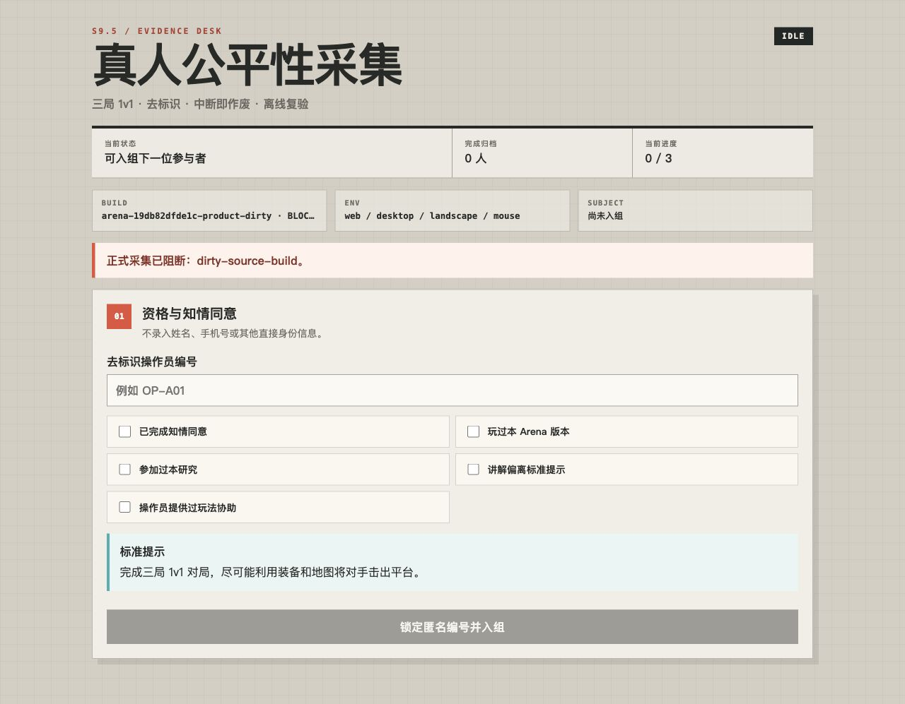

# Arena Stage 9 S9.5b 真人采集工作台与离线入库门禁记录

## 结论

2026-07-18 已建立与正式产品入口分离的 `/study.html`。工作台只负责知情同意/资格、连续入组、生命周期检查点、Product Session 组合、单参与者原始包和导出回执；Rule/Core、Bot、输入、比赛结果和 Replay 仍由同一 Product 路径产生。

本批没有招募或模拟真人样本，不生成可计入 S9.5 Report 的正式 Bundle。截图中的 dirty build 与桌面环境被明确标记为 `BLOCKED`，用于证明工程阻断有效，不是通过证据。

## 边界

```text
Human Study Workspace (small, synchronous, durable)
  ├── assignment / enrollment index
  ├── enrolled / running / reviewing / recovery / export-pending
  └── downloaded package receipt

Product Presentation Session (unchanged game path)
  ├── injected preregistered seedSource
  └── synchronous frozen { result, replay }

Human Capture Session (memory only)
  └── 0..3 complete Replay captures

Browser export (after authority step)
  └── UTF-8 raw package + Web Crypto SHA-256

Offline ingester
  ├── matches latest Workspace receipts to raw package SHA-256
  ├── verifies complete clean Web build
  ├── validates every raw package
  ├── strictly replays authority and regenerates Bot input per tick
  └── atomically publishes Bundle + replay artifacts
```

大 Replay 不进入同步 `localStorage`，Product `step()` 也不执行异步文件或网络 I/O。运行中/复核中刷新后，内存 Replay 已不可证明，Workspace 自动把该 assignment 转为零局 `running-recovered` 作废；`export-pending` 刷新则保留文件名、SHA-256 和大小，允许操作员核对已经下载的文件。

Product 玩家档案在采集会话内使用临时内存 Storage，避免前一位参与者的角色、奖励或解锁状态污染下一位。Study、Product 和 Presentation 保持单向依赖：Product 只认识通用 seed/完成端口，Study 不进入权威写入路径。

## 完整性与竞态

- Workspace 使用版本化 envelope、payload hash、A/B 双槽、read-back、CAS 与租约；同 generation 冲突和未来 schema fail closed。
- 一个 assignment 同时只能有 active checkpoint 或已确认 receipt；receipt enrollment 从 0 连续。
- 同步完成端口只接受当前预注册 seed 的完整 Replay；重复、漏包、异步 sink 或结果无法重建会关闭 Capture。
- 下载前对准确 UTF-8 字节计算 SHA-256；工作台不假装知道操作系统是否真正落盘，必须由操作员二次确认。
- 声明文件丢失会放弃原终态，要求为同一 assignment 导出零局作废包，不能跳号开始下一人。
- 最终入库强制提供最新 Workspace 审计账本；receipt 与原始包的 assignment、终态、package ID、文件名、SHA-256 和大小必须全部一致，旧下载包不能绕过后续作废决定。
- 离线 ingester 的输出目录必须不存在。全部包、clean build 和 Replay 通过后，才在已独占的新目录内原子发布 `evidence/`。
- ingester 和最终 verifier 都重算 clean Web build 的所有文件；最终 verifier 还会反向复验 Workspace → ingest manifest → 原始包 → Record → Replay 的完整链条，仅修改包内 commit/build 字符串不能通过。

## 本机证据

- Study/Workspace/CLI 与架构定向测试通过。
- 真实浏览器加载 `/study.html`，控制台无错误。
- dirty build 正确显示 `BLOCKED`，桌面/鼠标环境不允许正式入组。
- 修复了 author CSS 覆盖原生 `hidden` 后，非运行态“操作员中止”不再进入可访问树。
- 实现截图：[S9.5b 真人采集工作台](../quality/arena-stage9-human-study-workbench.png)。



## 尚未证明

- Web 手机竖屏触控真机上的完整三局、下载目录核对、前后台/旋转和崩溃恢复。
- 知情同意与隐私流程的实际执行。
- 至少 90 名合格完成者及退出/失效样本。
- S9.5 最终胜率、时长、自然度、公平感和再来一局门。

这些外部证据不能由 Node、桌面浏览器、脚本玩家或手写 JSON 替代。
